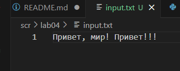
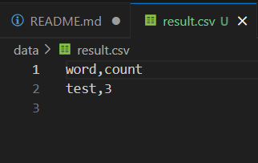

# mc


# Лабораторная работа 1
## Задание 1
```python
name = input("Имя: ")
age = int(input("Возраст: "))
print(f"Привет, {name}! Через год тебе будет {age + 1}.")
```


## Задание 2
```python
a = input('a: ')
b = input('b: ')
a = a.replace(',','.')
b = b.replace(',','.')
a = float(a)
b = float(b)
su = a+b
avg = su/2
print(f'sum={su:.2f}; avg={avg:.2f}')
```


## Задание 3
```python
price = int(input('price='))
discount = int(input('discount='))
vat = int(input('vat='))
base = price * (1 - discount/100)
vat_amount = base * (vat/100)
total = base + vat_amount
print(f'База после скидки: {base:.2f} ₽')
print(f'НДС: {vat_amount:.2f} ₽')
print(f'Итого к оплате: {total:.2f} ₽')
```


## Задание 4
```python
minu = int(input('Минуты: '))
hours = minu//60
mi = minu%60
print(f'{hours}:{mi:02d}')
```


## Задание 5
```python
fio = input("ФИО: ")
words = fio.split()

initials = ""
for w in words:
    i = "".join(w[0]).upper()
    initials = initials+i

fio = " ".join(words)
print("Инициалы: "+initials+".")
print("Длина (символов): ", len(fio))
```


# Лабораторная работа 2
## Задание A
```python
def min_max(nums: list[float | int]) -> tuple[float | int, float | int]:
    try:
        return tuple([min(nums), max(nums)])
    except ValueError:
        return 'ValueError'
    
print('min_max:')
print(min_max([3, -1, 5, 5, 0]))
print(min_max([42]))
print(min_max([-5, -2, -9]))
print(min_max([]))
print(min_max([1.5, 2, 2.0, -3.1]))

def unique_sorted(nums: list[float | int]) -> list[float | int]:
    n = sorted(set(nums))
    return n

print(' ')
print('unique_sorted:')
print(unique_sorted([3, 1, 2, 1, 3]))
print(unique_sorted([]))
print(unique_sorted([-1, -1, 0, 2, 2]))
print(unique_sorted([1.0, 1, 2.5, 2.5, 0]))

def flatten(mat: list[list | tuple]) -> list:
    res = []
    for st in mat:
        if not isinstance(st,(list,tuple)):
            return 'TypeError'
        for item in st:
            res.append(item)
    return res

print(' ')
print('flatten:')
print(flatten([[1, 2], [3, 4]]))
print((flatten([[1, 2], (3, 4, 5)])))
print(flatten([[1], [], [2, 3]]))
print(flatten([[1, 2], "ab"]))
```


## Задание B
```python
def transpose(mat: list[list[float | int]]) -> list[list]:
    if not mat:
        return []
    dlina1 = len(mat[0])
    for stroka in mat:
        if len(stroka) != dlina1:
            return 'ValueError (рваная матрица)'
    matr = []
    for j in range(dlina1):
        row = []
        for i in range(len(mat)):
            row.append(mat[i][j])
        matr.append(row)
    return matr
print('transpose:')
print(transpose([[1, 2, 3]]))
print(transpose([[1], [2], [3]]))
print(transpose([[1, 2], [3, 4]]))
print(transpose([]))
print(transpose([[1, 2], [3]]))
            
def row_sums(mat: list[list[float | int]]) -> list[float]:
    if not mat:
        return []
    dlina1 = len(mat[0])
    for stroka in mat:
        if len(stroka) != dlina1:
            return 'ValueError (рваная)'
    summ =[]
    for stroka in mat:
        summ.append(sum(stroka))
    return summ
print('')
print('row_sums:')
print(row_sums([[1, 2, 3], [4, 5, 6]]))
print(row_sums([[-1, 1], [10, -10]]))
print(row_sums([[0, 0], [0, 0]]))
print(row_sums([[1,2],[3]]))

def col_sums(mat: list[list[float | int]]) -> list[float]:
    if not mat:
        return []
    dlina1 = len(mat[0])
    for stroka in mat:
        if len(stroka) != dlina1:
            return 'ValueError (рваная)'
    summ = [0]*dlina1
    for stroka in mat:
        for j in range(dlina1):
            summ[j] += stroka[j]
    return summ
print('')
print('col_sums:')
print(col_sums([[1, 2, 3], [4, 5, 6]]))
print(col_sums([[-1, 1], [10, -10]]))
print(col_sums([[0, 0], [0, 0]]))
print(col_sums([[1, 2], [3]]))
```


## Задание C
```python
def format_record(rec: tuple[str, str, float]) -> str:
    fio,group,gpa = rec

    if not fio:
        raise ValueError('empty fio')
    if not group:
        raise ValueError('empty group')
    if not isinstance(gpa, (int, float)):
        raise TypeError('incorrect gpa')
    fio_parts = fio.split()
    fio_parts[0]= fio_parts[0].capitalize()
    if len(fio_parts)==3:
        initials = (fio_parts[1][0].upper() + '.') + (fio_parts[2][0].upper() + '.')
    if len(fio_parts)==2:
        initials = (fio_parts[1][0].upper() + '.')
    if len(fio_parts)>3 or len(fio_parts)<2:
        raise ValueError('fio')
    
    format_change = fio_parts[0] + ' ' + initials + ', гр. ' + group + ', GPA ' + '{:.2f}'.format(gpa)
    return format_change
    
print('format_record:')
print(format_record(("Иванов Иван Иванович", "BIVT-25", 4.6)))
print(format_record(("Петров Пётр", "IKBO-12", 5.0)))
print(format_record(("Петров Пётр Петрович", "IKBO-12", 5.0)))
print(format_record(("  сидорова  анна   сергеевна ", "ABB-01", 3.999)))
```


# Лабораторная работа 3
## Задание А
```python
import re
def normalize(text: str, *, casefold: bool = True, yo2e: bool = True) -> str:
    if casefold:
        text = text.casefold()

    if yo2e:
        text = text.replace('ё','е').replace('Ё','E')
    text = text.replace("\n", " ").replace("\t", " ").replace("\r", " ")
    while '  ' in text:
        text = text.replace('  ',' ')
    return text.strip()
print("normalize:")
print(normalize("ПрИвЕт\nМИр\t"))
print(normalize("ёжик, Ёлка"))
print(normalize("Hello\r\nWorld"))
print(normalize("  двойные  пробелы  "))

def tokenize(text: str) -> list[str]:
    return re.findall(r'\w+(?:-\w+)*', text)
print("")
print("tokenize:")
print(tokenize("привет мир"))
print(tokenize("hello,world!!!"))
print(tokenize("по-настоящему круто"))
print(tokenize("2025 год"))
print(tokenize("emoji 😀 не слово"))

def count_freq(tokens: list[str]) -> dict[str, int]:
    freq= {}
    for w in tokens:
        if w in freq:
            freq[w] += 1
        else:
            freq[w] = 1
    return freq
print("")
print("count_freq:")
print(count_freq(["a","b","a","c","b","a"]))

def top_n(freq: dict[str, int], n: int = 5) -> list[tuple[str, int]]:
    items = list(freq.items())
    items.sort()
    items.sort(key=lambda x: x[1],reverse=True)
    return items[:n]
print('')
print('top_n:')
print(top_n(count_freq(["bb","aa","bb","aa","cc"]), n=2))
```


## Задание B
```python
import sys
from lib.text import normalize, tokenize, count_freq, top_n

def main():
    text = "Привет, мир! Привет!!!"
    
    normalized_text = normalize(text)
    tokens = tokenize(normalized_text)
    freq = count_freq(tokens)
    top_words = top_n(freq, 5)
    
    print(f"всего слов: {len(tokens)}")
    print(f"уникальных слов: {len(freq)}")
    print("топ-5:")
    for word, count in top_words:
        print(f"{word}:{count}")

if __name__ == "__main__":
    main()
```


# Лабораторная 4
## Задание A
```python
from pathlib import Path
import csv
from typing import Iterable, Sequence
def read_text(path: str | Path, encoding: str = "utf-8") -> str:
    p = Path(path)
    return p.read_text(encoding=encoding)
"""
encoding: кодировка файла (по умолчанию "utf-8")
изменить кодировку: encoding="cp1251" 
"""
def write_csv(rows: list[tuple | list], path: str | Path, header: tuple[str, ...] | None = None) -> None:
    p = Path(path)
    ensure_parent_dir(p)
    rows = list(rows)
    if rows: 
        dlina1 = len(rows[0])
        for stroka in rows:
            if len(stroka) != dlina1:
                raise ValueError("Все строки должны иметь одинаковую длину.")
        
    with p.open('w', newline='', encoding='utf-8') as file:
        writer = csv.writer(file)
        if header is not None:
            writer.writerow(header)
        for row in rows:
            writer.writerow(row)
def ensure_parent_dir(path: str | Path) -> None:
    """Создать родительские директории, если их нет."""
    Path(path).parent.mkdir(parents=True, exist_ok=True)

if __name__ == "__main__":
    
    write_csv([("word", "count"), ("test", 3)], "data/result.csv")
    try:
        txt = read_text("scr/lab04/input.txt")
        print("Файл успешно прочитан")
    except FileNotFoundError:
        print("Файл input.txt не найден")
    except UnicodeDecodeError:
        print("Ошибка кодировки при чтении файла")
```




