# mc


# Лабораторная работа 1
## Задание 1
```python
name = input("Имя: ")
age = int(input("Возраст: "))
print(f"Привет, {name}! Через год тебе будет {age + 1}.")
```

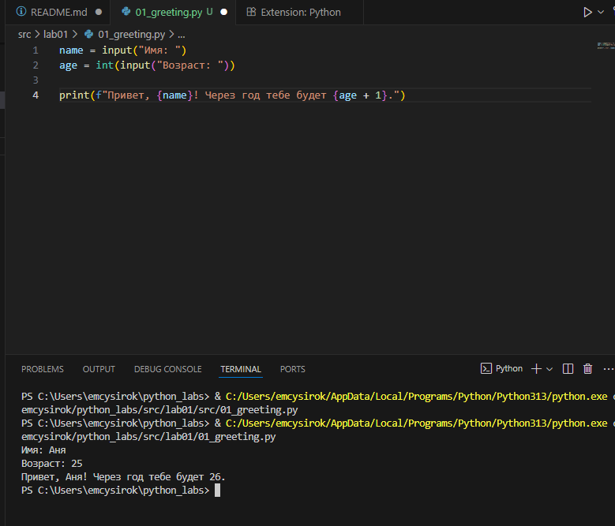


## Задание 2
```python
a = input('a: ')
b = input('b: ')
a = a.replace(',','.')
b = b.replace(',','.')
a = float(a)
b = float(b)
su = a+b
avg = su/2
print(f'sum={su:.2f}; avg={avg:.2f}')
```

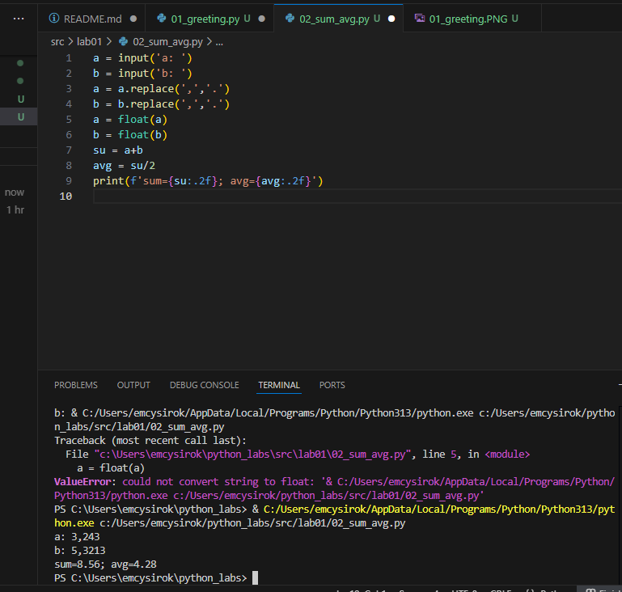


## Задание 3
```python
price = int(input('price='))
discount = int(input('discount='))
vat = int(input('vat='))
base = price * (1 - discount/100)
vat_amount = base * (vat/100)
total = base + vat_amount
print(f'База после скидки: {base:.2f} ₽')
print(f'НДС: {vat_amount:.2f} ₽')
print(f'Итого к оплате: {total:.2f} ₽')
```

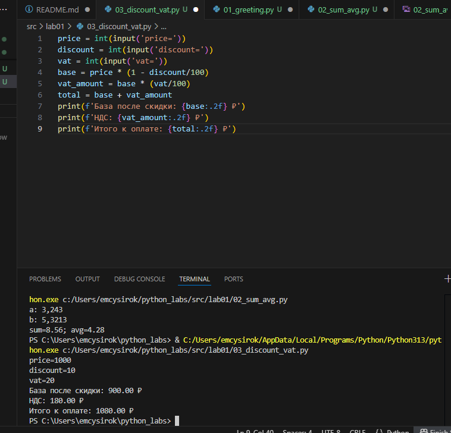


## Задание 4
```python
minu = int(input('Минуты: '))
hours = minu//60
mi = minu%60
print(f'{hours}:{mi:02d}')
```

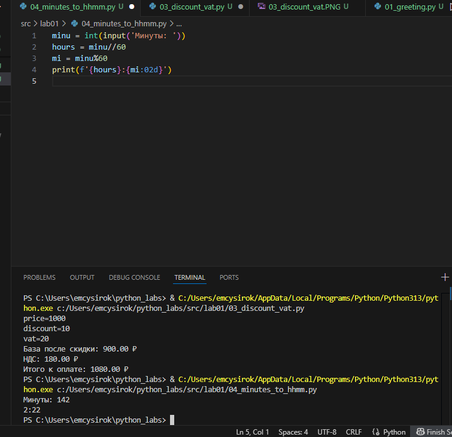


## Задание 5
```python
fio = input("ФИО: ")
words = fio.split()

initials = ""
for w in words:
    i = "".join(w[0]).upper()
    initials = initials+i

fio = " ".join(words)
print("Инициалы: "+initials+".")
print("Длина (символов): ", len(fio))
```

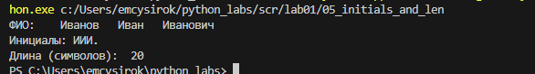


# Лабораторная работа 2
## Задание A
```python
def min_max(nums: list[float | int]) -> tuple[float | int, float | int]:
    try:
        return tuple([min(nums), max(nums)])
    except ValueError:
        return 'ValueError'
    
print('min_max:')
print(min_max([3, -1, 5, 5, 0]))
print(min_max([42]))
print(min_max([-5, -2, -9]))
print(min_max([]))
print(min_max([1.5, 2, 2.0, -3.1]))

def unique_sorted(nums: list[float | int]) -> list[float | int]:
    n = sorted(set(nums))
    return n

print(' ')
print('unique_sorted:')
print(unique_sorted([3, 1, 2, 1, 3]))
print(unique_sorted([]))
print(unique_sorted([-1, -1, 0, 2, 2]))
print(unique_sorted([1.0, 1, 2.5, 2.5, 0]))

def flatten(mat: list[list | tuple]) -> list:
    res = []
    for st in mat:
        if not isinstance(st,(list,tuple)):
            return 'TypeError'
        for item in st:
            res.append(item)
    return res

print(' ')
print('flatten:')
print(flatten([[1, 2], [3, 4]]))
print((flatten([[1, 2], (3, 4, 5)])))
print(flatten([[1], [], [2, 3]]))
print(flatten([[1, 2], "ab"]))
```

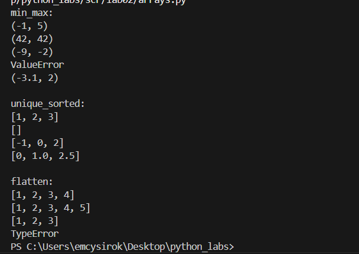


## Задание B
```python
def transpose(mat: list[list[float | int]]) -> list[list]:
    if not mat:
        return []
    dlina1 = len(mat[0])
    for stroka in mat:
        if len(stroka) != dlina1:
            return 'ValueError (рваная матрица)'
    matr = []
    for j in range(dlina1):
        row = []
        for i in range(len(mat)):
            row.append(mat[i][j])
        matr.append(row)
    return matr
print('transpose:')
print(transpose([[1, 2, 3]]))
print(transpose([[1], [2], [3]]))
print(transpose([[1, 2], [3, 4]]))
print(transpose([]))
print(transpose([[1, 2], [3]]))
            
def row_sums(mat: list[list[float | int]]) -> list[float]:
    if not mat:
        return []
    dlina1 = len(mat[0])
    for stroka in mat:
        if len(stroka) != dlina1:
            return 'ValueError (рваная)'
    summ =[]
    for stroka in mat:
        summ.append(sum(stroka))
    return summ
print('')
print('row_sums:')
print(row_sums([[1, 2, 3], [4, 5, 6]]))
print(row_sums([[-1, 1], [10, -10]]))
print(row_sums([[0, 0], [0, 0]]))
print(row_sums([[1,2],[3]]))

def col_sums(mat: list[list[float | int]]) -> list[float]:
    if not mat:
        return []
    dlina1 = len(mat[0])
    for stroka in mat:
        if len(stroka) != dlina1:
            return 'ValueError (рваная)'
    summ = [0]*dlina1
    for stroka in mat:
        for j in range(dlina1):
            summ[j] += stroka[j]
    return summ
print('')
print('col_sums:')
print(col_sums([[1, 2, 3], [4, 5, 6]]))
print(col_sums([[-1, 1], [10, -10]]))
print(col_sums([[0, 0], [0, 0]]))
print(col_sums([[1, 2], [3]]))
```

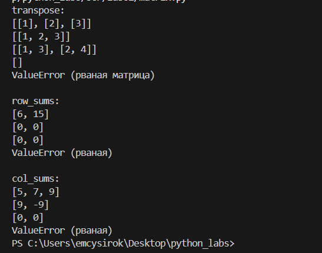


## Задание C
```python
def format_record(rec: tuple[str, str, float]) -> str:
    fio,group,gpa = rec

    if not fio:
        raise ValueError('empty fio')
    if not group:
        raise ValueError('empty group')
    if not isinstance(gpa, (int, float)):
        raise TypeError('incorrect gpa')
    fio_parts = fio.split()
    fio_parts[0]= fio_parts[0].capitalize()
    if len(fio_parts)==3:
        initials = (fio_parts[1][0].upper() + '.') + (fio_parts[2][0].upper() + '.')
    if len(fio_parts)==2:
        initials = (fio_parts[1][0].upper() + '.')
    if len(fio_parts)>3 or len(fio_parts)<2:
        raise ValueError('fio')
    
    format_change = fio_parts[0] + ' ' + initials + ', гр. ' + group + ', GPA ' + '{:.2f}'.format(gpa)
    return format_change
    
print('format_record:')
print(format_record(("Иванов Иван Иванович", "BIVT-25", 4.6)))
print(format_record(("Петров Пётр", "IKBO-12", 5.0)))
print(format_record(("Петров Пётр Петрович", "IKBO-12", 5.0)))
print(format_record(("  сидорова  анна   сергеевна ", "ABB-01", 3.999)))
```


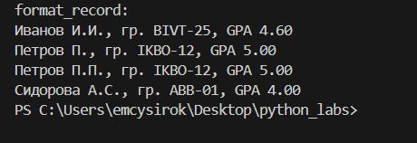


# Лабораторная работа 3
## Задание А
```python
import re
def normalize(text: str, *, casefold: bool = True, yo2e: bool = True) -> str:
    if casefold:
        text = text.casefold()

    if yo2e:
        text = text.replace('ё','е').replace('Ё','E')
    text = text.replace("\n", " ").replace("\t", " ").replace("\r", " ")
    while '  ' in text:
        text = text.replace('  ',' ')
    return text.strip()
print("normalize:")
print(normalize("ПрИвЕт\nМИр\t"))
print(normalize("ёжик, Ёлка"))
print(normalize("Hello\r\nWorld"))
print(normalize("  двойные  пробелы  "))

def tokenize(text: str) -> list[str]:
    return re.findall(r'\w+(?:-\w+)*', text)
print("")
print("tokenize:")
print(tokenize("привет мир"))
print(tokenize("hello,world!!!"))
print(tokenize("по-настоящему круто"))
print(tokenize("2025 год"))
print(tokenize("emoji 😀 не слово"))

def count_freq(tokens: list[str]) -> dict[str, int]:
    freq= {}
    for w in tokens:
        if w in freq:
            freq[w] += 1
        else:
            freq[w] = 1
    return freq
print("")
print("count_freq:")
print(count_freq(["a","b","a","c","b","a"]))

def top_n(freq: dict[str, int], n: int = 5) -> list[tuple[str, int]]:
    items = list(freq.items())
    items.sort()
    items.sort(key=lambda x: x[1],reverse=True)
    return items[:n]
print('')
print('top_n:')
print(top_n(count_freq(["bb","aa","bb","aa","cc"]), n=2))
```


## Задание B
```python
import sys
from lib.text import normalize, tokenize, count_freq, top_n

def main():
    text = "Привет, мир! Привет!!!"
    
    normalized_text = normalize(text)
    tokens = tokenize(normalized_text)
    freq = count_freq(tokens)
    top_words = top_n(freq, 5)
    
    print(f"всего слов: {len(tokens)}")
    print(f"уникальных слов: {len(freq)}")
    print("топ-5:")
    for word, count in top_words:
        print(f"{word}:{count}")

if __name__ == "__main__":
    main()
```


# Лабораторная 4
## Задание A
```python
from collections import Counter
import re
from pathlib import Path
import csv
from typing import Iterable, Sequence
def read_text(path: str | Path, encoding: str = "utf-8") -> str:
    p = Path(path)
    return p.read_text(encoding=encoding)
"""
encoding: кодировка файла (по умолчанию "utf-8")
изменить кодировку: encoding="cp1251" 
"""
def write_csv(rows: list[tuple | list], path: str | Path, header: tuple[str, ...] | None = None) -> None:
    p = Path(path)
    ensure_parent_dir(p)
    rows = list(rows)
    if rows: 
        dlina1 = len(rows[0])
        for stroka in rows:
            if len(stroka) != dlina1:
                raise ValueError("Все строки должны иметь одинаковую длину.")
        
    with p.open('w', newline='', encoding='utf-8') as file:
        writer = csv.writer(file)
        if header is not None:
            writer.writerow(header)
        for row in rows:
            writer.writerow(row)
def ensure_parent_dir(path: str | Path) -> None:
    """Создать родительские директории, если их нет."""
    Path(path).parent.mkdir(parents=True, exist_ok=True)

if __name__ == "__main__":
    
    try:
        txt = read_text("input.txt")
        words = re.findall(r'\w+', txt.lower())
        counts = Counter(words)
        sorted_words = sorted(counts.items(), key=lambda x: (-x[1], x[0]))
        
        write_csv(sorted_words, "report.csv", header=("word", "count"))
        
        print(f"Всего слов: {sum(counts.values())}")
        print(f"Уникальных слов: {len(counts)}")
        print("Топ-5:")
        for word, count in sorted_words[:5]:
            print(f"{word}:{count}")
            
    except FileNotFoundError:
        print("Файл input.txt не найден")
```

 
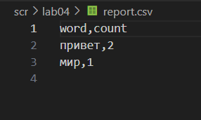
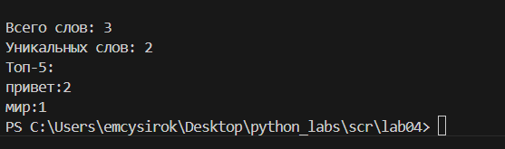

# Задание B
```python
import sys
from pathlib import Path

project_root = Path(__file__).parent.parent
sys.path.insert(0, str(project_root))

from lab03.lib.text import normalize, tokenize, count_freq, top_n
from lab04.io_txt_csv import read_text, write_csv

def main():
    input_file = "input.txt"
    output_file = "report.csv"

    try:
        text = read_text(input_file)
        print(f"файл {input_file} прочитан")
    
        normalized_text = normalize(text)
        tokens = tokenize(normalized_text)
        freq = count_freq(tokens)
        
        all_sorted_words = top_n(freq, len(freq))
        write_csv(all_sorted_words, output_file, header=("word", "count"))
        print(f"сохранено в {output_file}")
        
        total_words = len(tokens)
        unique_words = len(freq)
        
        print(f"всего слов: {total_words}")
        print(f"уникальных слов: {unique_words}")
        
        top_5_words = top_n(freq, 5)
        print("Топ-5:")
        for word, count in top_5_words:
            print(f"{word}:{count}")
            
    except FileNotFoundError:
        print(f"файл {input_file} не найден")
        sys.exit(1)
    except Exception as e:
        print(f"ошибка: {e}")
        sys.exit(1)

if __name__ == "__main__":
    main()
```

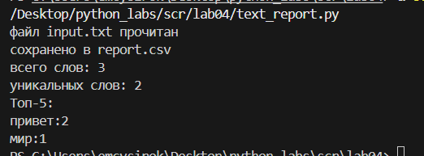 


# Лабораторная 5
## Задание A
```python
import json
import csv
from pathlib import Path

def json_to_csv(json_path: str, csv_path: str) -> None:
    """
    Преобразует JSON-файл в CSV.
    Поддерживает список словарей [{...}, {...}], заполняет отсутствующие поля пустыми строками.
    Кодировка UTF-8. Порядок колонок — как в первом объекте или алфавитный (указать в README).
    """
        # проверка: пути должны быть относительные
    if Path(json_path).is_absolute():
        raise ValueError("путь к JSON должен быть относительным")
    if Path(csv_path).is_absolute():
        raise ValueError("путь к CSV должен быть относительным")
    
    # проверка расширенийй
    if not json_path.lower().endswith('.json'):
        raise ValueError("нэ JSON")
    if not csv_path.lower().endswith('.csv'):
        raise ValueError("нэ CSV")
    
    # проверка файлов
    if not Path(json_path).exists():
        raise FileNotFoundError(f"файл не найден: {json_path}")
    
    # читааем JSON
    with open(json_path, 'r', encoding='utf-8') as f:
        data = json.load(f)
    
    # проверяяем данные
    if not data:
        raise ValueError("пустой JSON")
    if not isinstance(data, list):
        raise ValueError("JSON должен быть списком")
    if not all(isinstance(item, dict) for item in data):
        raise ValueError("все элементы должны быть словарями")
    
    # поля в алфавитном порядке
    fields = sorted(data[0].keys())
    
    # запись CSV
    Path(csv_path).parent.mkdir(parents=True, exist_ok=True)
    with open(csv_path, 'w', newline='', encoding='utf-8') as f:
        writer = csv.DictWriter(f, fieldnames=fields)
        writer.writeheader()
        for row in data:
            complete_row = {field: str(row.get(field, '')) for field in fields}
            writer.writerow(complete_row)

def csv_to_json(csv_path: str, json_path: str) -> None:
    """
    Преобразует CSV в JSON (список словарей).
    Заголовок обязателен, значения сохраняются как строки.
    json.dump(..., ensure_ascii=False, indent=2)
    """
    # проверка расширений
    if not csv_path.lower().endswith('.csv'):
        raise ValueError("нэ CSV")
    if not json_path.lower().endswith('.json'):
        raise ValueError("нэ SON")
    
    # проверка файлов
    if not Path(csv_path).exists():
        raise FileNotFoundError(f"файл не найден: {csv_path}")
    
    # читаеем CSV
    with open(csv_path, 'r', encoding='utf-8') as f:
        data = list(csv.DictReader(f))
    
    # проверяяем данные
    if not data:
        raise ValueError("пустой CSV")
    
    # запись JSON
    Path(json_path).parent.mkdir(parents=True, exist_ok=True)
    with open(json_path, 'w', encoding='utf-8') as f:
        json.dump(data, f, ensure_ascii=False, indent=2)
```

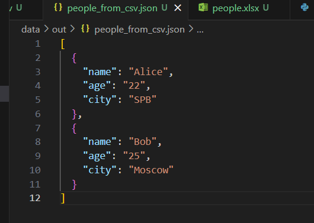 
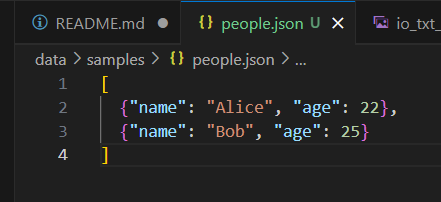


## Задание B
```python
import csv
from pathlib import Path
from openpyxl import Workbook
from openpyxl.utils import get_column_letter

def csv_to_xlsx(csv_path: str, xlsx_path: str) -> None:
    """
    Конвертирует CSV в XLSX.
    Использовать openpyx1 ИЛИ xlsxwriter.
    Первая строка CSV — заголовок.
    Лист называется "Sheet1".
    Колонки — автоширина по длине текста (не менее 8 символов).
    """
       # проверка
    if Path(csv_path).is_absolute() or Path(xlsx_path).is_absolute():
        raise ValueError("пути должн быть относительными")
    if not csv_path.endswith('.csv') or not xlsx_path.endswith('.xlsx'):
        raise ValueError("неверные расширения файлов")
    if not Path(csv_path).exists():
        raise FileNotFoundError(f"файл не найден: {csv_path}")
    
    # читаеем CSV
    with open(csv_path, "r", encoding="utf-8") as f:
        rows = list(csv.reader(f))
    
    if not rows or not any(rows[0]):
        raise ValueError("пустой CSV или нет заголовка")
    
    # создаем Excel
    wb = Workbook()
    ws = wb.active
    ws.title = "Sheet1"
    
    # записываем данные и считаем ширину
    max_lengths = []
    for row in rows:
        ws.append(row)
        for i, value in enumerate(row):
            if i >= len(max_lengths):
                max_lengths.append(0)
            max_lengths[i] = max(max_lengths[i], len(str(value or "")))
    
    # устанавливаем ширину колонок
    for i, length in enumerate(max_lengths, 1):
        ws.column_dimensions[get_column_letter(i)].width = max(length + 2, 8)
    
    # сохраняем
    Path(xlsx_path).parent.mkdir(parents=True, exist_ok=True)
    wb.save(xlsx_path)

if __name__ == "__main__":
    csv_to_xlsx("data/samples/people.csv", "data/out/people.xlsx")
```

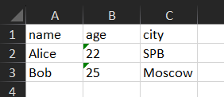


# Лабораторная 6
## cli_text.py
```python
import argparse
import sys
import os

current_dir = os.path.dirname(os.path.abspath(__file__))  # папка lab06
project_root = os.path.dirname(os.path.dirname(current_dir))  # папка python_labs
sys.path.insert(0, project_root)  # добавляем путь к проекту

from scr.lib.text import *

def cat(text, n):
    # открытие и чтение файлаа
    with open(text, "r", encoding='utf-8') as file:
        lines = file.readlines()
    
    # вывод строки файла
    if not n:
        for line in lines:
            print(line.rstrip('\n'))
    else:
        # нумер строк
        for i, line in enumerate(lines, 1):
            print(f"{i} {line.rstrip('\n')}")

def stats(txt, n):
    # чит содержимое файла
    with open(txt, "r", encoding='utf-8') as file:
        content = file.read()
    
    result = top_n(count_freq(tokenize(normalize(content))), n)
    
    print(f"топ-{n} слов:")
    for word, count in result:
        print(f"'{word}' - {count} раз")

parser = argparse.ArgumentParser("CLI‑утилиты лабораторной №6")

subparsers = parser.add_subparsers(dest="command")

cat_parser = subparsers.add_parser("cat", help="вывести содержимое файла")
cat_parser.add_argument("--input", required=True)
cat_parser.add_argument("-n", action="store_true", help="нумеровать строки")

stats_parser = subparsers.add_parser("stats", help="частоты слов")
stats_parser.add_argument("--input", required=True)
stats_parser.add_argument("--top", type=int, default=5)

# разбир аргументы
args = parser.parse_args()

# выполн команду
if args.command == "cat":
    cat(args.input, args.n)

if args.command == "stats":
    stats(args.input, args.top)
```
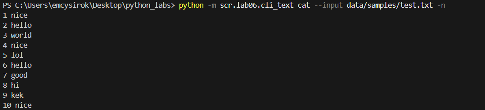
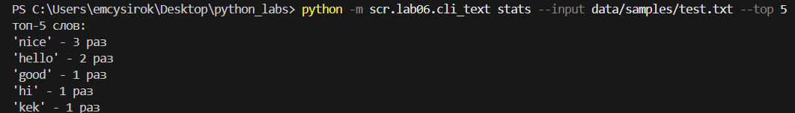

## cli_convert.py
```python
import argparse
import sys
from scr.lab05.csv_xlsx import csv_to_xlsx
from scr.lab05.json_csv import json_to_csv, csv_to_json

parser = argparse.ArgumentParser("CLI‑утилиты лабораторной №6") # создаем главный парсер 
subparsers = parser.add_subparsers(dest="command", required=True) # добавляем подпарсеры для разных команд
# dest="command" сохраняет выбранную команду в args.command
# required=True обязательна (иначе покажет help)

json2csv_parser = subparsers.add_parser("json2csv")  # создаем подпарсер
json2csv_parser.add_argument("--in", required=True, dest='input')  # добавляем обязательный аргумент --in
# dest='input' переименовывает его в args.input
json2csv_parser.add_argument("--out", required=True)  # добавляем обязательный аргумент --out для выходного файла

csv2json_parser = subparsers.add_parser("csv2json")
csv2json_parser.add_argument("--in",required=True,dest='input')  # обязательный входной файл (--in → args.input)
csv2json_parser.add_argument("--out",required=True) # обязательный выходной файл

csv2xlsx_parser = subparsers.add_parser("csv2xlsx")
csv2xlsx_parser.add_argument("--in",required=True,dest='input') # входной файл csv
csv2xlsx_parser.add_argument("--out",required=True) # выходной файл xlsx

args = parser.parse_args() # парсим аргументы командной строки, переданные при запуске программы

# try/except для обработки ошибок
try:
    if args.command == "json2csv":
        json_to_csv(args.input, args.out)
        print(f"json → csv: {args.input} → {args.out}")

    if args.command == "csv2json":
        csv_to_json(args.input, args.out)
        print(f"csv → json: {args.input} → {args.out}")

    if args.command == "csv2xlsx":
        csv_to_xlsx(args.input, args.out)
        print(f"csv → xlsx: {args.input} → {args.out}")

except Exception as e:
    print(f"ошибка: {e}")
    sys.exit(1)
```
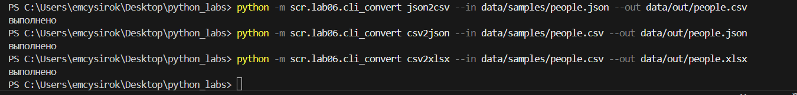


# Лабораторная 7
## задание A

```python
import pytest
from scr.lib.text import normalize, tokenize, count_freq, top_n

@pytest.mark.parametrize(
    "text, expected",
    [
        ("ПрИвЕт МИр", "привет мир"),
        ("ёжик, Ёлка", "ежик, елка"),
        ("Hello World", "hello world"),
        ("  двойные   пробелы  ", "двойные пробелы"),
    ],
)
def test_normalize(text, expected):
    assert normalize(text) == expected


@pytest.mark.parametrize(
    "text, expected",
    [
        ("привет мир", ["привет", "мир"]),
        ("привет, мир!", ["привет", "мир"]),
        ("по-настоящему круто", ["по-настоящему", "круто"]),
        ("2025 год", ["2025", "год"]),
        ("", []),
        ("   ", []),   
    ],
)
def test_tokenize(text, expected):
    assert tokenize(text) == expected

@pytest.mark.parametrize(
    "tokens, expected",
    [
        (["привет", "мир", "привет"], {"привет": 2, "мир": 1}),
        ([], {}),
        (["да"], {"да": 1}),
        (["добрый", "день", "добрый", "вечер"], {"добрый": 2, "день": 1, "вечер": 1}),
    ],
)
def test_count_freq(tokens, expected):
    assert count_freq(tokens) == expected

@pytest.mark.parametrize(
    "freq, n, expected",
    [
        ({"привет": 5, "мир": 3, "пока": 7}, 2, [("пока", 7), ("привет", 5)]),
        ({"да": 3, "нет": 3, "наверное": 3}, 3, [("да", 3), ("наверное", 3), ("нет", 3)]),
        ({}, 5, []),
        ({"ок": 1}, 1, [("ок", 1)]),
        ({"да": 1, "нет": 2}, 10, [("нет", 2), ("да", 1)]),
    ],
)
def test_top_n(freq, n, expected):
    assert top_n(freq, n) == expected
```
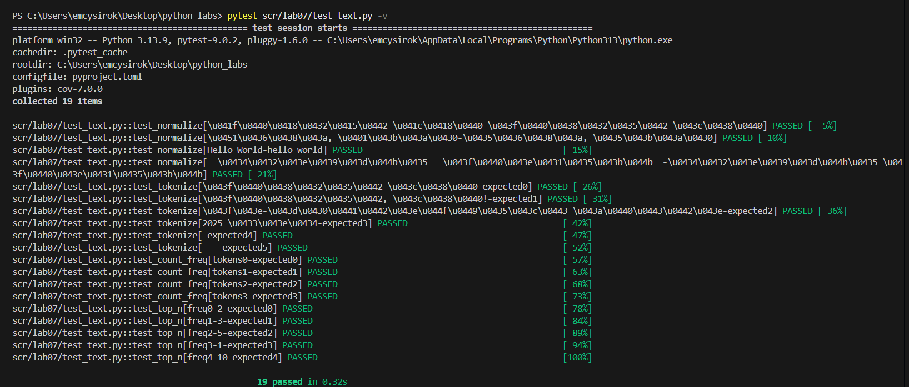

## задание B
```python
import pytest
import json
import csv
import os
from scr.lab05.json_csv import json_to_csv, csv_to_json

def run_in_tmp(func, tmp_path, src, dst):
    """запускает функцию с относительными путями в tmp_path"""
    os.chdir(tmp_path)
    try:
        func(src, dst)
    finally:
        os.chdir("..")

# поз тесты
def test_json_to_csv_ok(tmp_path):
    with open(tmp_path / "test.json", "w") as f:
        json.dump([{"name": "Alice", "age": 25}], f)
    
    run_in_tmp(json_to_csv, tmp_path, "test.json", "out.csv")
    
    with open(tmp_path / "out.csv") as f:
        rows = list(csv.DictReader(f))
        assert len(rows) == 1
        assert rows[0]["name"] == "Alice"

def test_csv_to_json_ok(tmp_path):
    # csv должен содержать данные а не тольк заголовок
    with open(tmp_path / "test.csv", "w", newline="") as f:
        writer = csv.DictWriter(f, ["name", "age"])
        writer.writeheader()
        writer.writerow({"name": "Bob", "age": "30"})
    
    run_in_tmp(csv_to_json, tmp_path, "test.csv", "out.json")
    
    with open(tmp_path / "out.json") as f:
        result = json.load(f)
        assert len(result) == 1
        assert result[0]["name"] == "Bob"

# нег тесты
def test_json_to_csv_wrong_path(tmp_path):
    os.chdir(tmp_path)
    with pytest.raises(FileNotFoundError):
        json_to_csv("no.json", "out.csv")
    os.chdir("..")

def test_csv_to_json_wrong_path(tmp_path):
    os.chdir(tmp_path)
    with pytest.raises(FileNotFoundError):
        csv_to_json("no.csv", "out.json")
    os.chdir("..")

def test_json_to_csv_empty(tmp_path):
    (tmp_path / "empty.json").write_text("")
    os.chdir(tmp_path)
    with pytest.raises(ValueError):
        json_to_csv("empty.json", "out.csv")
    os.chdir("..")

def test_csv_to_json_empty(tmp_path):
    (tmp_path / "empty.csv").write_text("")
    os.chdir(tmp_path)
    with pytest.raises(ValueError):
        csv_to_json("empty.csv", "out.json")
    os.chdir("..")

# round-trip с учётом того что csv всё сохраняет как строки
def test_round_trip(tmp_path):
    # Исходные данные
    data = [{"a": 1, "b": 2}]
    
    # JSON → CSV
    (tmp_path / "1.json").write_text(json.dumps(data))
    os.chdir(tmp_path)
    json_to_csv("1.json", "data.csv")
    csv_to_json("data.csv", "2.json")
    os.chdir("..")
    
    with open(tmp_path / "2.json") as f:
        result = json.load(f)
    
    # в csv всё становится строками поэтому после цикла получаем строки
    assert result == [{"a": "1", "b": "2"}]
```
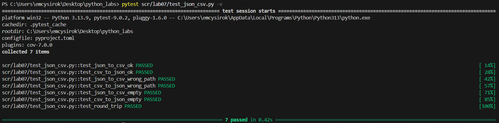


# Лабораторная 8
## задание A

```python
from dataclasses import dataclass # для автоматического создания методов класса
from datetime import datetime, date # для работы с датами
@dataclass # декоратор автоматически создающий конструктор __init__ и другие методы
class Student:
    fio: str
    birthdate: str
    group: str
    gpa: float
    def __post_init__(self): # метод после конструктора __init__
        try:
            datetime.strptime(self.birthdate, "%Y-%m-%d") # пытаемся преобразовать строку в дату по указанному формату
        except ValueError:
            raise ValueError # если не получается - выбрасываем ошибку
        if not (0 <= self.gpa <= 5): # проверка диапазона среднего баллаа
            raise ValueError
    def age(self) -> int: # метод для вычисления возраста студента
        birth_date = datetime.strptime(self.birthdate, "%Y-%m-%d").date() # преобразуем строку с датой рождения в объект date
        today = date.today() # получаем текущую дату
        age = today.year - birth_date.year # вычисляем разницу в годах
        if today.month < birth_date.month or (today.month == birth_date.month and today.day < birth_date.day): # корректируем возраст, если день рождения в этом году еще не наступил
            age -= 1
        return age
    def to_dict(self) -> dict: # преобразование объекта в словарь
        return {
            "fio": self.fio,
            "birthdate": self.birthdate,
            "group": self.group,
            "gpa": self.gpa
        }
    @classmethod # метод класса для создания объекта из словаря
    def from_dict(cls, data: dict): # создаем новый объект класса, передавая значения из словаря
        return cls(
            fio=data["fio"],
            birthdate=data["birthdate"],
            group=data["group"],
            gpa=data["gpa"]
        )
    def __str__(self): # метод для строкового представления объекта
        return f"Студент: {self.fio}, Группа: {self.group}, GPA: {self.gpa}, Возраст: {self.age()} лет"
```

## задание B
```python
import json
import os
from .models import Student

def students_to_json(students: list[Student], path: str): # функция для сохранения списка студентов в json
    data = [student.to_dict() for student in students] # преобразуем каждый объект student в словарь с помощью метода to_dict()
    os.makedirs(os.path.dirname(path), exist_ok=True) # создаем папки по указанному пути, если они не существуют, exist_ok=True означает, что не будет ошибки если папка уже существует
    with open(path, 'w', encoding='utf-8') as f: # открываем файл для записи
        json.dump(data, f, ensure_ascii=False, indent=2) # ensure_ascii=False - разрешаем кириллицу, indent=2 - красивое форматирование с отступами
def students_from_json(path: str) -> list[Student]: # функция для загрузки списка студентов из json
    with open(path, 'r', encoding='utf-8') as f: # открываем файл для чтения
        data = json.load(f) # загружаем данные из json в переменную data
    students = []
    for item in data:
        student = Student.from_dict(item) # создаем объект student из словаря с помощью метода from_dict()
        students.append(student) 
    return students
```
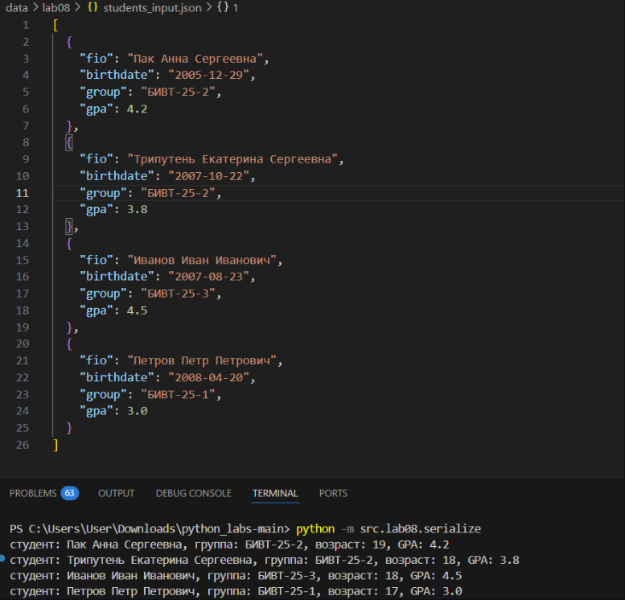
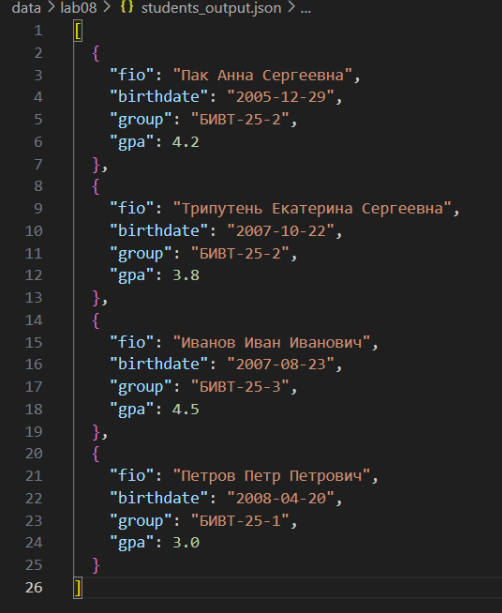
