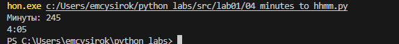

# mc


# Лабораторная работа 1
## Задание 
```python
name = input("Имя: ")
age = int(input("Возраст: "))
print(f"Привет, {name}! Через год тебе будет {age + 1}.")
```


## Задание 2
```python
a = input('a: ')
b = input('b: ')
a = a.replace(',','.')
b = b.replace(',','.')
a = float(a)
b = float(b)
su = a+b
avg = su/2
print(f'sum={su:.2f}; avg={avg:.2f}')
```


## Задание 3
```python
price = int(input('price='))
discount = int(input('discount='))
vat = int(input('vat='))
base = price * (1 - discount/100)
vat_amount = base * (vat/100)
total = base + vat_amount
print(f'База после скидки: {base:.2f} ₽')
print(f'НДС: {vat_amount:.2f} ₽')
print(f'Итого к оплате: {total:.2f} ₽')
```


## Задание 4
```python
minu = int(input('Минуты: '))
hours = minu//60
mi = minu%60
print(f'{hours}:{mi:02d}')
```




## Задание 5
```python
fio = input("ФИО: ")
words = fio.split()

initials = ""
for w in words:
    i = "".join(w[0]).upper()
    initials = initials+i

fio = " ".join(words)
print("Инициалы: "+initials+".")
print("Длина (символов): ", len(fio))
```


